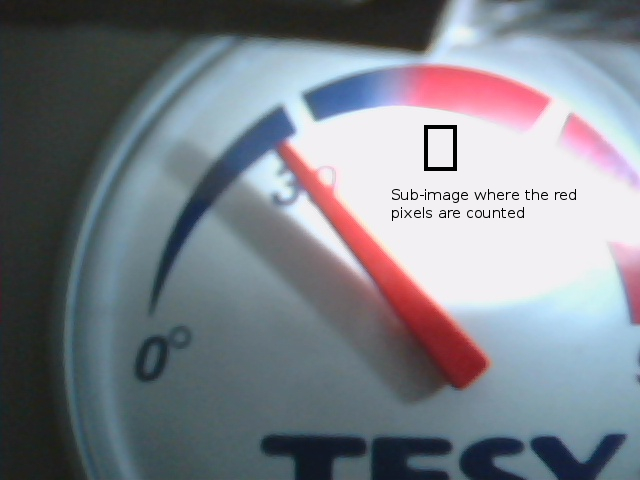
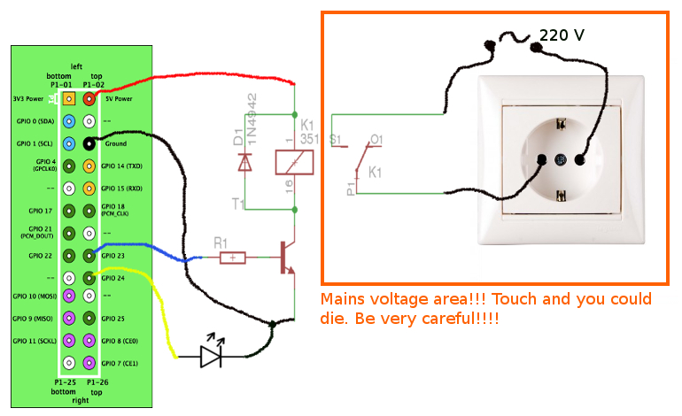

raspboil
========

Raspboil is a project that uses a Raspberry Pi for a water boiler control via e-mail and image processing.

The project uses the wiringPi library and openCV.

The instructions assume that you already have Raspbian installed on your card.

You will also need to create an e-mail address at gmail for your Raspberry Pi.

# Why

When I created this project I was living in a rented appartment that had a water boiler to heat the water.

Water boilers heat the water to a certain temperature, then turn off nd when the water temperature decreases they turn back on.

This was not very convenient for me because it was wasting energy to constantly reheat water even when I was not using it.

That's why I was keeping the boiler off until I was doing a shower or bath. For a shower, 10-30 minutes would be sufficient to heat the water, but for a bath it needed at least an hour in winter.

So I created this project where I could send an e-mail to the RaspberryPi with the date and time when to start the boiler. The RPi would turn on the boiler and monitor it's analogue temperature indicator and shut it down when it reached about 45 degrees Celsius.

This way I could have hot water in the morning or when I came back home without keeping the boiler permanently on.

# How

To start the boiler send an e-mail to the boiler with the `start dd/MM/hh/mm` format. You can also send a `stop` e-mail to the boiler for immediate shutdown.

The program will only accept command e-mails from a hard coded mail address to avoid being abused by other people.

To turn on/off the boiler, Raspberry Pi uses a GPIO to control a relay. The relay turns on/off the mains power to the boiler.

The approach needed to be non-invasive to the boiler since the appartment was rented and it was safer after all.

In order to know when to shut off the boiler, RPi uses a USB camera to monitor the analogue temperature indicator.

A white LED commanded by a RPi GPIO is used to light up the temperature indicator for low light conditions.

System uses openCV to process a sub-image of the camera capture where the needle will be when the temperature reaches about 45 degrees Celsius.
When that sub-image is filled mostly with red pixels, red being the color of the indicator needle, it means that the boiler reached the desired temperature and can be shut off.

During initial testing I found out that the white light from the LED would contain a big count of red, green and blue pixels, making the program think that the needle reached the desired position.

So in order to distinguish the presence of the needle from the LED light we need to count lots of red pixels, but the green and blue pixel count needs to be low as the color of the needle is pure red.

As a safety measure I added a 1,5 hours timer that will shut down the boiler, just in case something goes wrong with the indicator needle detection.

# Schematic

# Installation

To install  wiringPi:
http://wiringpi.com/download-and-install/

To install and use openCV:
<pre><code>sudo apt-get update
sudo apt-get install cmake
sudo apt-get install libopencv-dev
</code></pre>

Building and installing the main daemon:
<pre><code>mkdir /home/pi/bin
cd boilerwatch
gcc boil.c -o boil -lwiringPi
cp boil /home/pi/bin
cd ..
</code></pre>

Building and installing the image processing binary:
<pre><code>cd imageprocessing
cmake .
make
cp imageproc /home/pi/bin
cd ..
</code></pre>

Installing the python scripts and the init script:
<pre><code>cp mail.py /home/pi/bin
cp check_time.py /home/pi/bin
sudo cp boiler_script /etc/init.d/
sudo update-rc.d boiler_script defaults
</code></pre>

After following these steps the raspboil project will be auto-started at system startup by the init script.

To use the project, replace the username and password in `mail.py` at line 113 with the gmail username and password that you created for your Raspberry Pi system. Also add your e-mail address from which the Raspberry Pi will receive mails in `mail.py` at line 12.

# Youtube demo (potato quality)
https://www.youtube.com/watch?v=7xG8IllBSoc
